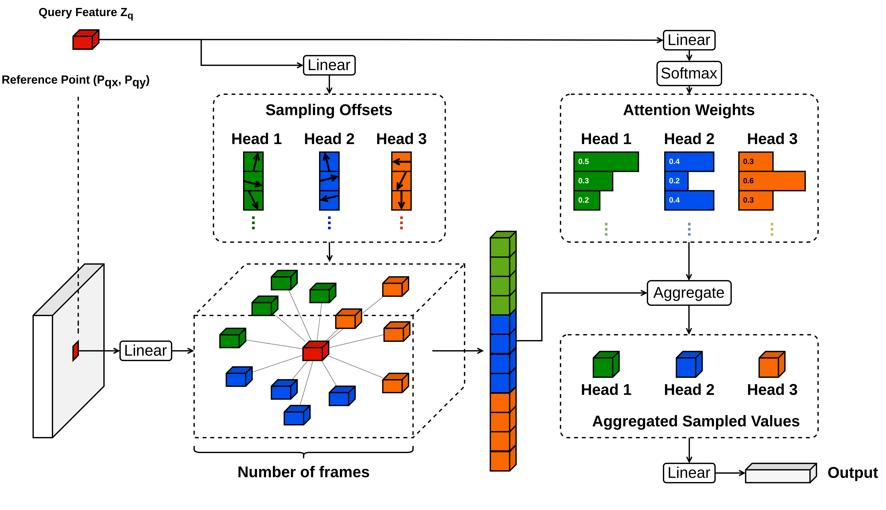

# Sequential DDETR

This repository is an implementation of **"Sequential Deformable DETR (Sequential DDETR)"**, modify from [Deformable DETR](https://github.com/fundamentalvision/Deformable-DETR).

## Introduction

Sequential DDETR inherits the main advantage of Deformable DETR, which is an efficient and fast-converging end-to-end object detector. Here, Sequential DDETR views the object detection task as a direct end-to-end parallel sequence decoding/prediction problem, which supervises and segments instances at the sequence level as a whole.

The main sequential deformable attention module is as follow:



## License

This project is released under the [Apache 2.0 license](./LICENSE).

## Installation

### Requirements

- Linux, CUDA>=9.2, GCC>=5.4
- Python>=3.7

  We recommend you to use Anaconda to create a conda environment:

  ```bash
  conda create -n sequential_ddetr python=3.7 pip
  ```

  Then, activate the environment:

  ```bash
  conda activate sequential_ddetr
  ```

- PyTorch>=1.5.1, torchvision>=0.6.1 (following instructions [here](https://pytorch.org/))

  For example, if your CUDA version is 9.2, you could install pytorch and torchvision as following:

  ```bash
  conda install pytorch=1.5.1 torchvision=0.6.1 cudatoolkit=9.2 -c pytorch
  ```

- Other requirements
  ```bash
  pip install -r requirements.txt
  ```

### Compiling CUDA operators

```bash
cd ./models/msda
sh ./make.sh
# unit test (should see all checking is True)
python test.py
```

## Usage

### Dataset preparation

Please download [ScanNet dataset](http://www.scan-net.org/) and organize them as following:

### Training

#### Training on single node

For example, the command for training Sequential DDETR on 8 GPUs is as following:

```bash
GPUS_PER_NODE=8 ./tools/run_dist_launch.sh 8 ./configs/r50_deformable_detr.sh
```

#### Training on multiple nodes

For example, the command for training Sequential DDETR on 2 nodes of each with 8 GPUs is as following:

On node 1:

```bash
MASTER_ADDR=<IP address of node 1> NODE_RANK=0 GPUS_PER_NODE=8 ./tools/run_dist_launch.sh 16 ./configs/r50_deformable_detr.sh
```

On node 2:

```bash
MASTER_ADDR=<IP address of node 1> NODE_RANK=1 GPUS_PER_NODE=8 ./tools/run_dist_launch.sh 16 ./configs/r50_deformable_detr.sh
```

#### Training on slurm cluster

If you are using slurm cluster, you can simply run the following command to train on 1 node with 8 GPUs:

```bash
GPUS_PER_NODE=8 ./tools/run_dist_slurm.sh <partition> deformable_detr 8 configs/r50_deformable_detr.sh
```

Or 2 nodes of each with 8 GPUs:

```bash
GPUS_PER_NODE=8 ./tools/run_dist_slurm.sh <partition> deformable_detr 16 configs/r50_deformable_detr.sh
```

#### Some tips to speed-up training

- If your file system is slow to read images, you may consider enabling '--cache_mode' option to load whole dataset into memory at the beginning of training.
- You may increase the batch size to maximize the GPU utilization, according to GPU memory of yours, e.g., set '--batch_size 3' or '--batch_size 4'.
